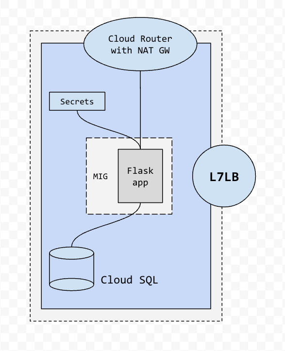

# FLASK APP WITH CONNECTION TO MYSQL, SECRETS MANAGER, AND MIG

## General File Structure:

```
eballest@cloudshell:~ (eballest-sandbox)$ tree votr/
votr/
|-- main.tf
|-- scripts
|   `-- startup.sh
|-- terraform.tf
`-- variables.tf
```
## Implementation Topology:


## Summary:

This is a template to implement a flask app running on a cloud compute engine instance, that connects to a mysql database running on cloud SQL, with root user and password stored on a secrets manager, and gets exposed with a external http load balancer.

-  variables.tf: contains all the variables of the template
-  main.tf: contains the resources used on this
-  terraform.tf: contains the provider information

The backend of this template is local, but a remote backend can be implemented as well.

## Functional Implementation:

This is an app developed on flask, that connects to a SQL database to store the results of a real-time poll, for the connection to the SQL database (which runs on a Cloud SQL instance), is done via private service connect, the root user and password are stored on secret manager, also the firewall rules are implemented to ensure connectivity on the project. The L7LB is implemented with a module that abstracts the complexity behind creating a L7LB on GCP. IAM service accounts are implemented to separate the roles of the instances, and allow access to the secrets API, the Cloud Router + NAT Gateway is used to download the necessary packages from the internet to implement the flask app on the Compute Instance.


